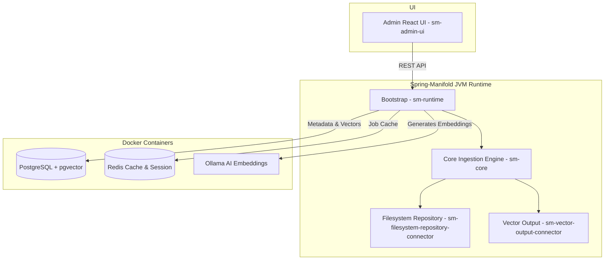

# Spring-Manifold Next-Gen

[](LICENSE)
[](https://jdk.java.net/25/)
[](https://spring.io/projects/spring-boot)
[](https://www.docker.com/)

**Spring-Manifold Next-Gen** is an enterprise data integration and ingestion platform modeled after Apache ManifoldCF. It leverages modern Java 25 features (such as Structured Concurrency and Virtual Threads), Spring Boot, and vector search infrastructure to orchestrate data flows from various repository connectors to vector search outputs.

<p align="center">
  
</p>

---

## Architecture Diagram

The diagram below shows the high-level architecture of Spring-Manifold Next-Gen:



---

## Core Technologies

- **Java 25 Preview Features**: Structured Concurrency, Virtual Threads, and Pattern Matching.
- **Spring Boot & Spring AI**: High-performance backend orchestrating ingestion jobs.
- **pgvector**: High-dimensional vector similarity search in PostgreSQL.
- **Redis Stack**: Lightweight caching and session management.
- **Ollama**: Local AI embedding generation via open-source LLM models.
- **Vite + React + TailwindCSS**: Modern frontend administration dashboard.

---

## Getting Started

### Prerequisites

Ensure you have the following installed on your machine:
- **JDK 25** (Ensure `JAVA_HOME` points to your JDK 25 directory)
- **Maven 3.9+**
- **Docker & Docker Compose**
- **Node.js 18+ & npm** (for the UI)

---

### Step-by-Step Setup

#### 1. Start Infrastructure (Docker)
Spin up the database, cache, and AI engine. Run from the project root:
```bash
docker compose up -d
```
**Services started:**
* **PostgreSQL (Port 5432)**: For job metadata, schema migrations, and pgvector storage.
* **Redis (Port 6379 / Insight Port 8001)**: For caching and session management.
* **Ollama (Port 11434)**: For local embeddings.

#### 2. Pull the Embedding Model (Ollama)
The platform is configured to use the `mxbai-embed-large` model for embeddings. You must pull it once:
```bash
docker exec -it ollama ollama pull mxbai-embed-large
```
*(You can exit the prompt with `Ctrl+D` once the download starts; Ollama will keep downloading in the background).*

#### 3. Build the Project (Maven)
Compile all modules using Java 25. Since we utilize advanced features, preview features must be enabled:
```bash
mvn clean install
```

#### 4. Run the Runtime Bootstrap
Start the Spring Boot runtime application:
```bash
mvn spring-boot:run -pl sm-runtime -Dspring-boot.run.profiles=dev
```

#### 5. Run the Admin UI
To launch the administration dashboard:
```bash
cd sm-admin-ui
npm install
npm run dev
```
Open [http://localhost:5173](http://localhost:5173) in your browser.

---

## Verification & Monitoring

- **Database**: Access PostgreSQL at `localhost:5432` (User: `manifold`, DB: `manifold`).
- **Redis Dashboard**: Open [http://localhost:8001](http://localhost:8001) in your browser to view the Redis Stack Insight dashboard.
- **Logs**: Monitor console output for the Virtual Thread Executor and Structured Concurrency task logs.

---

## Troubleshooting

- **Java Version Check**: Run `java -version` to confirm you are using Java 25.
- **Preview Features**: If your IDE fails to compile structured concurrency code, verify that the `--enable-preview` JVM argument is configured for compiler and runtime settings. (It is already pre-configured in `pom.xml`).
