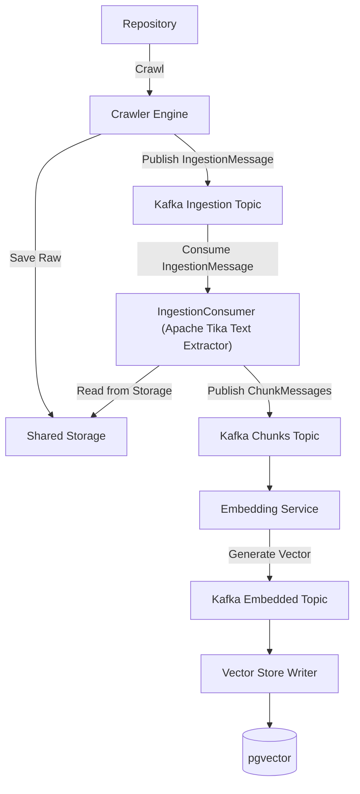

# System Architecture

OpenCrawling is designed for high-throughput, horizontal scalability. The platform is broken down into modular microservices that communicate asynchronously using **Apache Kafka**.

---

## 🏗️ Component Breakdown

The architecture is divided into the following primary layers:

### 1. Ingestion Runtime Bootstrap (`oc-runtime`)
The central orchestrator that schedules, runs, and monitors crawling jobs. It executes the crawlers, manages rate-limiting, and stores job states in PostgreSQL.

### 2. Core Ingestion Engine (`oc-core`)
Houses the main crawler SPI definitions. Once a crawler discovers a document, the core engine saves the file content to shared storage and publishes a lightweight pointer to the queue.

### 3. Decoupled Embedding Service (`oc-embedding-service`)
A stateless microservice that pulls text chunks from Kafka, requests vector embeddings from the configured AI engine (such as local Ollama instances or cloud OpenAI endpoints), and publishes the resulting vectors. This microservice can be scaled out instantly:
```bash
docker compose scale oc-embedding-service=3
```

### 4. Vector Store Writer (`VectorStoreWriterConsumer` / `VespaStoreWriterConsumer`)
Consumes embedded chunks and writes them directly to database outputs (such as PostgreSQL with `pgvector`, Elasticsearch, Qdrant, Milvus, OpenSearch, Vespa, or Solr). It uses a stateless model to write raw vectors directly, bypassing model inference.

### 5. Secure Model Context Protocol Server (`McpVectorServer`)
Exposes knowledge retrieval tools to AI models and agents using the Model Context Protocol (MCP). It handles SSE-based queries, authenticates user identities, and filters search results by matching document ACL tokens.

### 6. Optional gRPC Transport Layer (`oc-grpc-api` / `InternalTransportManager`)
Provides binary Protobuf payload streaming over HTTP/2 (default port `9095`) for high-speed inter-node communication between `oc-repository-connectors`, `oc-core`, `oc-worker`, and `oc-output-connectors`. Features dynamic mode switching (`AUTO`, `GRPC`, `REST`), defaulting to `AUTO` mode with automatic fallback to HTTP/REST, TLS/mTLS encryption, and real-time connectivity testing from the Admin Dashboard.

### 7. ManifoldCF Migration Engine (`oc-mcf-migrator`)
A modular translation engine that bridges Apache ManifoldCF crawler configurations (repository, output, transformation connections, and jobs) into OpenCrawling. Reusable as a standalone CLI JAR, embedded within `oc-cli` under `oc mcf`, and powering the `/api/mcf-migration/*` REST endpoints and the `oc-admin-ui` migration wizard.

### 8. Pluggable Connector Ecosystem (`oc-*-repository-connector`)
Enterprise boundary adapters that stream structured and unstructured data from heterogeneous sources (Relational databases via JDBC, Alfresco, CMIS, Camunda, Flowable, FileSystem, Iceberg, StormCrawler). Employs Java 25 Virtual Threads, Structured Concurrency, schema introspection, zero-trust security ACL mapping, and dual-path ingestion.

---

## 🛞 Asynchronous Claim Check Pattern

To avoid clogging Kafka partitions with megabytes of binary file data (PDFs, Excel files, DOCX), OpenCrawling uses the **Claim Check Pattern**:



1.  **Crawl & Check-In**: The repository connector discovers a document. Instead of sending the full payload, it saves the file to a shared file/object storage and publishes an `IngestionMessage` (the Claim Check) to Kafka.
2.  **Text Extraction & Chunking**: The `IngestionConsumer` reads the message, fetches the file from storage, extracts text using **Apache Tika**, splits it into semantic chunks, and publishes them to `opencrawling-chunks`.
3.  **Embedding Generation**: The `oc-embedding-service` consumes chunks, generates embedding vectors, and pushes them to `opencrawling-embedded`.
4.  **Vector Store Sync**: The `VectorStoreWriterConsumer` saves the vectors, metadata, and Security SIDs into the vector database.

### 🪦 Document Lifecycle Actions & Tombstone Deletes

OpenCrawling supports the **Open Ingestion Standard (OIS)** specification for document lifecycle management (`action: "UPSERT" | "DELETE"`). When a tombstone deletion (`action: "DELETE"`) is published:
- **Claim Check Bypass**: `JobOrchestrator` skips binary storage persistence.
- **Pipeline Short-Circuiting**: `IngestionConsumer` and `oc-embedding-service` bypass Tika parsing, chunking, and AI embedding generation, directly forwarding tombstone deletion messages downstream.
- **Vector Store Purge**: Output store consumers (pgvector, Solr, Qdrant, Milvus, Vespa, OpenSearch) execute targeted deletion queries to purge documents and vector chunks.

---

## 📊 Distributed Tracing & Observability Architecture

OpenCrawling implements end-to-end distributed tracing across all component and microservice boundaries to enable AIOps Root Cause Analysis:

1.  **Connector & Virtual Thread Boundaries**:
    Jobs run inside Java Virtual Threads for lightweight concurrency. Because virtual threads do not inherit trace context automatically under Java 25 Structured Concurrency guidelines (`StructuredTaskScope`), OpenCrawling encapsulates thread tasks within `ObservabilityTask.observed(task)`. This helper captures the parent OTel span context and restores it inside the virtual thread scope before child execution begins.
2.  **Kafka Messaging Boundaries**:
    Micrometer Observation features are enabled on Kafka listeners and templates. Trace context headers (e.g. `traceparent`) are automatically injected into Kafka records, ensuring traces span across the crawler, chunking consumer, embedding services, and vector store writer.
3.  **OTel Collector Pipeline**:
    Spans are exported to the OpenTelemetry Collector using the OTLP protocol. The collector splits and routes traces to Jaeger and exposes performance metrics to Prometheus.
4.  **Real-Time Trace Interceptor**:
    Spans are intercepted in real-time by a Spring-managed `TelemetryTraceStore` implementing `SpanExporter`. This bridge registers spans and errors in an in-memory repository to generate AI-assisted Root Cause Analysis (RCA) reports inside the Admin UI.

---

## 🔌 Repository Connector Architecture & Extensibility Blueprint

OpenCrawling provides an extensible connector framework that bridges heterogeneous enterprise systems to downstream vector search engines and AI agents. The platform implements connectors using **Java 25 Virtual Threads**, **Structured Concurrency**, and the **Open Ingestion Standard (OIS)**.

This section defines the architectural blueprint and step-by-step engineering guidelines for implementing additional repository connectors, following the design of the [`JdbcRepositoryConnector`](file:///Users/piergiorgiolucidi/Documents/workspaces/opencrawling/opencrawling-in-org/oc-jdbc-repository-connector/src/main/java/org/opencrawling/jdbc/JdbcRepositoryConnector.java).

```
┌────────────────────────────────────────────────────────────────────────────────────────┐
│                               Repository Connector                                     │
│  - Java 25 Virtual Threads & Structured Concurrency (StructuredTaskScope)             │
│  - Schema Introspection (ConnectorSchema) for AI Narrativization Copilot               │
│  - Server-Side Cursor / Streaming Pagination (Constant Heap O(1))                     │
│  - Dual Ingestion Paths: Tabular Narrativization (RAG) vs Raw BLOB Direct Embeddings  │
│  - Zero-Trust Security ACL Mapping (SecurityConfig & PermissionRule)                   │
│  - Change Data Capture (HWM) & Soft-Delete Tombstone Generation                        │
└───────────────────────────┬────────────────────────────────────────────────────────────┘
                            │ Emits Flux<RepositoryDocument>
                            ▼
┌────────────────────────────────────────────────────────────────────────────────────────┐
│                                   JobOrchestrator                                      │
│  - Transformation Connectors (Mustache applied to Tabular rows; BLOBs bypassed)        │
│  - Claim Check Offloading (ClaimCheckStore: Local FS / MinIO / S3)                     │
│  - Publishes lightweight IngestionMessage to Kafka (opencrawling-ingestion)             │
└───────────────────────────┬────────────────────────────────────────────────────────────┘
                            │ Kafka Event Streaming
             ┌──────────────┴──────────────┐
             ▼                             ▼
┌─────────────────────────────┐   ┌────────────────────────────────┐
│      Ingestion Consumer     │   │     Decoupled Embedding Svc    │
│  - Tika Extraction / OCR    │   │  - Ollama / OpenAI             │
│  - TokenTextSplitter        │   │  - Vector Generation           │
└─────────────┬───────────────┘   └───────────────┬────────────────┘
              │                                   │
              └─────────────────┬─────────────────┘
                                ▼
┌────────────────────────────────────────────────────────────────────────────────────────┐
│                        Vector Output & Storage Layer                                   │
│  - VectorOutputConnector / PgVectorStore / Milvus / Qdrant / OpenSearch / Vespa        │
│  - Secure Model Context Protocol (MCP) Server with Server-Side ACL Enforcement         │
└────────────────────────────────────────────────────────────────────────────────────────┘
```

### 1. Core Connector SPI Contracts

All connectors implement the sealed interface [`Connector`](file:///Users/piergiorgiolucidi/Documents/workspaces/opencrawling/opencrawling-in-org/oc-core/src/main/java/org/opencrawling/core/connector/Connector.java):

```java
package org.opencrawling.core.connector;

public sealed interface Connector permits RepositoryConnector, TransformationConnector, OutputConnector {
    String getName();
    void connect() throws Exception;
    void disconnect() throws Exception;
}
```

Repository connectors implement [`RepositoryConnector`](file:///Users/piergiorgiolucidi/Documents/workspaces/opencrawling/opencrawling-in-org/oc-core/src/main/java/org/opencrawling/core/connector/RepositoryConnector.java):

```java
package org.opencrawling.core.connector;

import org.opencrawling.core.document.RepositoryDocument;
import reactor.core.publisher.Flux;

public non-sealed interface RepositoryConnector extends Connector {
    Flux<RepositoryDocument> scan(String basePath);

    default ConnectorSchema getSchema(String basePath) {
        return new ConnectorSchema(java.util.List.of());
    }
}
```

- **`getName()`**: Returns the unique human-readable connector identifier (e.g., `"JdbcConnector"`, `"MongoDbConnector"`).
- **`connect()`**: Establishes connection pools (e.g., HikariCP, HTTP client pools) and executes validation health checks.
- **`disconnect()`**: Gracefully releases pooled connections, shuts down background task executors, and frees resources.
- **`getSchema(basePath)`**: Introspects source fields, types, and descriptions to produce a [`ConnectorSchema`](file:///Users/piergiorgiolucidi/Documents/workspaces/opencrawling/opencrawling-in-org/oc-core/src/main/java/org/opencrawling/core/connector/ConnectorSchema.java) used by AI-assisted narrativization copilots and the Admin UI.
- **`scan(basePath)`**: Scans the designated target path, query, or table, emitting a non-blocking stream of [`RepositoryDocument`](file:///Users/piergiorgiolucidi/Documents/workspaces/opencrawling/opencrawling-in-org/oc-core/src/main/java/org/opencrawling/core/document/RepositoryDocument.java) instances.

---

### 2. The Seven Pillars of a Production Connector

Every enterprise connector in OpenCrawling must satisfy seven architectural pillars:

1. **Java 25 Virtual Threads & Structured Concurrency**:
   Never block platform OS threads. Use Java 25 Virtual Threads (`Thread.ofVirtual()`) and Spring's `SimpleAsyncTaskExecutor` with `setVirtualThreads(true)`. Coordinate concurrent work (such as multi-table crawling, batch item processing, or partition scanning) inside a [`StructuredTaskScope`](file:///Users/piergiorgiolucidi/Documents/workspaces/opencrawling/opencrawling-in-org/oc-jdbc-repository-connector/src/main/java/org/opencrawling/jdbc/JdbcRepositoryConnector.java#L615-L665). Allow external injection of Spring `AsyncTaskExecutor` and `TaskDecorator` beans for testability.
2. **Distributed Observability & Context Propagation**:
   Virtual threads spawned by `StructuredTaskScope` do not automatically inherit OpenTelemetry trace contexts. Wrap all tasks using [`ObservabilityTask.observed(callable)`](file:///Users/piergiorgiolucidi/Documents/workspaces/opencrawling/opencrawling-in-org/oc-observability/src/main/java/org/opencrawling/observability/concurrency/ObservabilityTask.java) so that active trace IDs, span contexts, and Micrometer observations flow seamlessly through subtasks into Kafka records.
3. **Schema Introspection for AI & Copilots**:
   Implementing `getSchema(basePath)` allows the platform, Admin UI, and Spring AI Narrativization Copilots to inspect available source fields, data types, and nullability, recommending optimized RAG ingestion strategies automatically.
4. **Constant Heap Memory ($O(1)$) Streaming**:
   Never load entire result sets, large files, or binary trees into memory. For databases, use server-side cursor streaming (e.g. `setFetchSize(1000)` in JDBC). For files and BLOBs, emit raw `InputStream` handles wrapped in [`RepositoryDocument`](file:///Users/piergiorgiolucidi/Documents/workspaces/opencrawling/opencrawling-in-org/oc-core/src/main/java/org/opencrawling/core/document/RepositoryDocument.java).
5. **Dual Ingestion Paths (Tabular Narrativization vs. Direct BLOB Embeddings)**:
   - **Tabular Rows**: Relational records and structured entities lack a single binary document body. They must be transformed into natural language text (narrativized) using Mustache templates or Markdown tables for Tabular RAG.
   - **Binary BLOBs / Documents**: Files, PDFs, and images contain unstructured data. They must bypass text templating, preserving the raw binary stream for Apache Tika parsing, OCR, and direct vector embeddings.
6. **Zero-Trust Security & ACL Enforcement**:
   Every crawled document must carry its security context using [`SecurityConfig`](file:///Users/piergiorgiolucidi/Documents/workspaces/opencrawling/opencrawling-in-org/oc-core/src/main/java/org/opencrawling/core/security/SecurityConfig.java). Connectors map source roles, groups, users, and tenants into [`PermissionRule`](file:///Users/piergiorgiolucidi/Documents/workspaces/opencrawling/opencrawling-in-org/oc-core/src/main/java/org/opencrawling/core/security/PermissionRule.java) records (`USER`, `GROUP`, `TENANT` with `READ`, `WRITE`, `DENY`), alongside a flat legacy `acl` token string for vector database filters.
7. **Change Data Capture (CDC) & Soft Deletions**:
   Support incremental crawling via High-Water Mark (HWM) tracking (timestamp, sequence number, version). Identify soft-deleted or purged records and emit `DocumentAction.DELETE` tombstones to remove outdated vectors from pgvector, Milvus, Qdrant, and OpenSearch.

---

### 3. Dual Ingestion Architecture: Tabular RAG vs. BLOBs

```
                             ┌────────────────────────────────────────────────────────┐
                             │               Source Entity Ingestion                  │
                             └──────────────────────────┬─────────────────────────────┘
                                                        │
                                    Does entity contain a BLOB / Binary payload?
                                                        │
                                ┌───────────────────────┴────────────────────────┐
                                │                                                │
                              [YES]                                             [NO]
                                │                                                │
                 ┌──────────────▼──────────────┐                  ┌──────────────▼──────────────┐
                 │    Binary BLOB / Document   │                  │     Tabular Standard Row    │
                 │   (PDF, PNG, JPEG, DOCX...) │                  │   (Relational row fields)   │
                 └──────────────┬──────────────┘                  └──────────────┬──────────────┘
                                │                                                │
                Preserve Raw Binary Stream                        Generate Structured Narrative
                (Bypasses Mustache transformation)                (Mustache template or Markdown)
                                │                                                │
                 ┌──────────────▼──────────────┐                  ┌──────────────▼──────────────┐
                 │       Direct Embedding      │                  │         Tabular RAG         │
                 │  - Tika Text/OCR Extraction │                  │  - Embedded natural text    │
                 │  - Descriptive Fallback     │                  │  - Column metadata index    │
                 └─────────────────────────────┘                  └─────────────────────────────┘
```

#### Automatic BLOB & MIME Detection Blueprint
In [`JdbcRepositoryConnector`](file:///Users/piergiorgiolucidi/Documents/workspaces/opencrawling/opencrawling-in-org/oc-jdbc-repository-connector/src/main/java/org/opencrawling/jdbc/JdbcRepositoryConnector.java#L1040-L1164), binary columns and MIME types are resolved without requiring mandatory user configuration:
1. **Type Inspection**: Inspect SQL types (`Types.BLOB`, `Types.BINARY`, `Types.VARBINARY`, `Types.LONGVARBINARY`).
2. **Name Heuristics**: Identify column naming patterns (`file_data`, `attachment`, `image_bytes`, `content_blob`, `document_body`).
3. **Magic Byte Sniffing**: Inspect leading binary bytes:
   - `\x89PNG\r\n\x1a\n` $\rightarrow$ `image/png`
   - `\xFF\xD8\xFF` $\rightarrow$ `image/jpeg`
   - `%PDF-` $\rightarrow$ `application/pdf`
   - `PK\x03\x04` $\rightarrow$ `application/zip` (Office DOCX/XLSX, ZIP)
   - `GIF8` $\rightarrow$ `image/gif`, `RIFF....WEBP` $\rightarrow$ `image/webp`
4. **Descriptive Fallback Embedding**: When images are ingested without OCR enabled in Tika, [`IngestionConsumer`](file:///Users/piergiorgiolucidi/Documents/workspaces/opencrawling/opencrawling-in-org/oc-runtime/src/main/java/org/opencrawling/runtime/messaging/IngestionConsumer.java) and [`VectorOutputConnector`](file:///Users/piergiorgiolucidi/Documents/workspaces/opencrawling/opencrawling-in-org/oc-vector-output-connector/src/main/java/org/opencrawling/vector/VectorOutputConnector.java) synthesize structured text representations (entity ID, title, filename, author, MIME type) ensuring that vector stores and AI agents can semantically discover and retrieve the image assets.

---

### 4. Step-by-Step Implementation Guide for Additional Connectors

Follow these 11 steps to implement any new repository connector:

#### Step 1: Module Creation & Maven Structure
Create a new Maven module: `oc-<name>-repository-connector`:
- Add dependencies on `oc-core`, `oc-observability`, reactive streams (`reactor-core`), Spring context, Jackson, and the target client SDK/driver.
- Register the module in the root `pom.xml` under `<modules>` and `<dependencyManagement>`.

#### Step 2: Implement the Connector Class Skeleton
Implement [`RepositoryConnector`](file:///Users/piergiorgiolucidi/Documents/workspaces/opencrawling/opencrawling-in-org/oc-core/src/main/java/org/opencrawling/core/connector/RepositoryConnector.java). Equip the class with Spring configuration annotations (`@Component`, `@Autowired`, `@Value`) and constructors supporting both automated DI and manual programmatic instantiation.

#### Step 3: Lifecycle Management (`connect`, `disconnect`, `@PreDestroy`)
- `connect()`: Establish connection pools and validate reachability (e.g., `isValid(5)` or ping commands).
- `disconnect()`: Cleanly close pools and terminate virtual thread executors.
- `@PreDestroy cleanup()`: Ensure no resources leak during application shutdown.

#### Step 4: Schema Introspection (`getSchema`)
Extract target metadata (field names, data types, descriptions) to populate [`ConnectorSchema`](file:///Users/piergiorgiolucidi/Documents/workspaces/opencrawling/opencrawling-in-org/oc-core/src/main/java/org/opencrawling/core/connector/ConnectorSchema.java) for AI copilot features and UI configuration.

#### Step 5: High-Throughput Cursor Streaming & Structured Concurrency (`scan`)
Combine reactive streams with Java 25 `StructuredTaskScope`:
- Use `Flux.create(sink -> ...)` to emit documents asynchronously.
- Wrap background subtasks in `ObservabilityTask.observed(...)` to propagate trace context.
- Partition large datasets or multi-target scans concurrently using `scope.fork(...)` and `scope.join()`.

#### Step 6: Constructing `RepositoryDocument` (OIS Standards)
Every emitted document must follow the Open Ingestion Standard:
- `id`: Unique identifier within the target repository.
- `uri`: Uniform Resource Identifier (e.g. `jdbc:table/id`).
- `contentStream`: Raw `InputStream` (binary BLOB) or narrativized Markdown `InputStream` (tabular row).
- `metadata`: `Map<String, List<String>>` containing title, filename, MIME type, flags (`is_blob`, `is_tabular`, `media_type`).
- `acl` / `security`: Zero-trust security tokens and `SecurityConfig` rules.
- `lastModified`: Instant used for incremental crawling.
- `action`: `DocumentAction.UPSERT` or `DocumentAction.DELETE` (tombstone).

#### Step 7: Case-Insensitive Narrativization & Template Compilation
When building narrativization for tabular or structured entities:
- Configure `Mustache.compiler().defaultValue("").nullValue("").compile(...)`.
- Provide a context map containing original keys, lowercased keys, and uppercased keys to guarantee template compatibility across different naming conventions.

#### Step 8: Platform Runtime Registration
- In `oc-runtime/pom.xml`, add the new connector dependency.
- In [`JobController.java`](file:///Users/piergiorgiolucidi/Documents/workspaces/opencrawling/opencrawling-in-org/oc-runtime/src/main/java/org/opencrawling/runtime/api/JobController.java), resolve the connector by type string.
- In [`ConnectorController.java`](file:///Users/piergiorgiolucidi/Documents/workspaces/opencrawling/opencrawling-in-org/oc-runtime/src/main/java/org/opencrawling/runtime/api/ConnectorController.java), register the connector class for UI auto-discovery.
- In [`ConnectorCheckerService.java`](file:///Users/piergiorgiolucidi/Documents/workspaces/opencrawling/opencrawling-in-org/oc-runtime/src/main/java/org/opencrawling/runtime/service/ConnectorCheckerService.java), implement health-check probing.

#### Step 9: Admin UI Integration (`ConnectorForm.tsx`)
In [`ConnectorForm.tsx`](file:///Users/piergiorgiolucidi/Documents/workspaces/opencrawling/opencrawling-in-org/oc-admin-ui/src/components/ConnectorForm.tsx), register the connector configuration form with validation (credentials, endpoints, primary keys, cursor fetch size, narrativization templates, and ACL columns).

#### Step 10: Docker Packaging & Decoupled Compose
- Ensure the connector JAR is bundled in `docker/Dockerfile.crawler` and `docker/Dockerfile.ingestion-consumer`.
- Provide a dedicated `docker-compose-decoupled-with-<name>.yml` with the source repository container and sample seed data.

#### Step 11: Comprehensive Test Automation
Every connector requires two test suites:
1. **Unit Test Suite** (e.g., [`JdbcRepositoryConnectorTest.java`](file:///Users/piergiorgiolucidi/Documents/workspaces/opencrawling/opencrawling-in-org/oc-jdbc-repository-connector/src/test/java/org/opencrawling/jdbc/JdbcRepositoryConnectorTest.java)):
   Verifies lifecycle, schema introspection, structured concurrency, BLOB magic byte detection, tabular narrativization, and tombstone deletes.
2. **Bash Integration Scripts**:
   - `scripts/test-<name>-connector.sh`: Verifies the connector against an embedded or local Docker container.
   - `scripts/test-<name>-decoupled.sh`: Verifies the full decoupled pipeline from source to Kafka, Ingestion Consumer, Ollama embeddings, pgvector writing, and MCP server queries.

---

### 5. Connector Quality Checklist

Before submitting a new connector PR, ensure the following checklist is satisfied:

| Requirement | Description | Status |
|---|---|---|
| **Non-blocking Concurrency** | Employs Java 25 Virtual Threads and `StructuredTaskScope` | [ ] |
| **Trace Context Propagation** | Wraps all forked subtasks in `ObservabilityTask.observed()` | [ ] |
| **Schema Introspection** | Implements `getSchema(basePath)` returning accurate `ConnectorSchema` | [ ] |
| **$O(1)$ Heap Streaming** | Uses server-side cursors / streaming without accumulating items in memory | [ ] |
| **Dual Path Ingestion** | Separates tabular rows (narrativization) from binary BLOBs (direct embedding) | [ ] |
| **MIME Sniffing** | Detects MIME types via magic bytes and filename extensions | [ ] |
| **Descriptive Fallbacks** | Provides metadata fallback text when binary items lack OCR/text | [ ] |
| **Zero-Trust Security** | Populates `SecurityConfig` with `PermissionRule` and legacy `acl` tokens | [ ] |
| **CDC & Tombstones** | Emits `DocumentAction.DELETE` for deleted/purged records | [ ] |
| **UI Form Registration** | Configured in `ConnectorForm.tsx` with validation | [ ] |
| **Integration Scripts** | Dedicated standalone integration test scripts in `scripts/` | [ ] |
