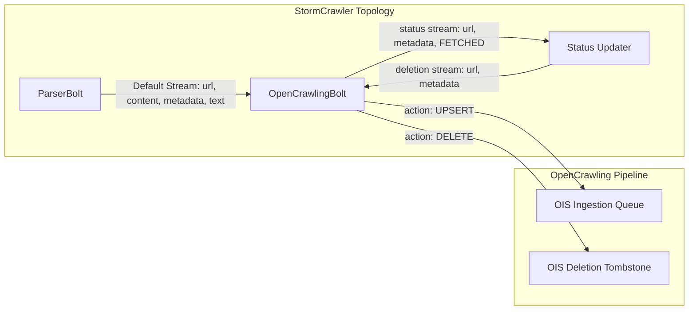

# OpenCrawling - Apache StormCrawler Bolt

The `oc-stormcrawler-bolt` module provides an Apache Storm Bolt library (`org.opencrawling:oc-stormcrawler-bolt`) that intercepts parsed web documents and the status updater's deletion stream in **Apache StormCrawler** topologies.

It normalizes crawled records into **Open Ingestion Standard (OIS)** payloads:
- **`action: "UPSERT"`**: For newly discovered and updated web pages emitted by `ParserBolt`.
- **`action: "DELETE"`**: For the URLs the StormCrawler status updater emits on its `deletion` stream (`Constants.DELETION_STREAM_NAME`): pages whose status became `ERROR`, for instance after `max.fetch.errors` consecutive fetch errors such as HTTP 404.

## Architecture & Stream Mapping



## Features
- **Dual-Stream Processing**: Ingests parsed content tuples and the status updater's deletion tuples.
- **OIS Compliance**: Maps crawled web pages into standard OIS `UPSERT` documents and deletion `tombstones`.
- **Content Deduplication**: Calculates document content hashes (`SHA-256` or `MD5`) for deduplication and incremental crawl detection.
- **Flexible Dispatching**:
  - `REST`: POSTs OIS JSON payloads to `opencrawling.target.endpoint`, which points at `oc-runtime`'s `/api/v1/ingest/ois/{jobId}`. The job gives the pages their embedding model. The runtime enables the endpoint only when `opencrawling.ingest.ois.token` is set, and the bolt sends that token through `opencrawling.http.auth.header` as `Bearer <token>`. The default endpoint, `http://localhost:8080/api/v1/ingest/ois`, has no job id and the runtime does not accept it.
  - `MEMORY`: In-memory dispatcher for embedded topologies and test suites.

## Indexer Behavior

`OpenCrawlingBolt` extends StormCrawler's `AbstractIndexerBolt` and takes the place of the indexer in a topology:

- It puts the parser's `text` field in the OIS `content.text`; the `content` field (the raw fetched bytes) is only used for `metadata.contentHash`.
- After a successful dispatch it emits `(url, metadata, FETCHED)` on the `status` stream and acks the tuple; if the dispatch fails, the tuple fails and no status is emitted. Subscribe the status updater to the bolt's `status` stream, as for any StormCrawler indexer: Storm rejects a topology that subscribes to a stream the bolt does not declare.
- The OIS `id` is the fetched URL, for UPSERT and DELETE alike.
- It turns each tuple of the status updater's `deletion` stream into an OIS DELETE: `metadata.stormcrawler.status` is `ERROR` and `metadata.http.status` is the `fetch.statusCode` of the last fetch, absent when there is none (for instance a robots.txt denial). The status updater emits these tuples unanchored: if the DELETE dispatch fails, it is not replayed. `opencrawling.emit.deletions: false` acknowledges them without dispatching.
- Tuples on a `status` stream are acknowledged and not dispatched.

It reads these StormCrawler indexer settings:

| Setting | Effect |
|---|---|
| `indexer.md.mapping` | Metadata keys copied to the OIS `metadata`, with optional renaming (`parse.title=title`); the first value of each key is used. Unmapped keys are not sent. |
| `indexer.canonical.name` | Metadata key holding the canonical URL, sent as `metadata.canonical.url` when it is on the same registered domain as the fetched URL; otherwise the fetched URL is sent. |
| `indexer.md.filter` | Only documents whose metadata match are dispatched. Pages marked `robots.noIndex` are never dispatched. Both kinds are still reported as `FETCHED`. |

`indexer.text.fieldname`, `indexer.url.fieldname`, `indexer.text.maxlength`, `indexer.md.docid` and `indexer.ignore.empty.fields` have no effect: OIS has fixed field names, `content.text` is sent in full, and the OIS `id` is always the fetched URL.

## Topology Wiring (`crawler.flux`)

Starting from the StormCrawler archetype's `crawler.flux`, replace the indexer class and add a stream from the status updater to the bolt; the archetype already sends the parsers' output to `index` and the `status` stream of `index` to `status`:

```yaml
bolts:
  - id: "index"
    className: "org.opencrawling.stormcrawler.bolt.OpenCrawlingBolt"
    parallelism: 1

streams:
  - from: "status"
    to: "index"
    grouping:
      type: LOCAL_OR_SHUFFLE
      streamId: "deletion"
```

The status updater can be any StormCrawler status updater that extends `AbstractStatusUpdaterBolt`, which declares the `deletion` stream.

## Topology Configuration (`crawler-conf.yaml`)

```yaml
config:
  topology.workers: 2
  topology.message.timeout.secs: 30
  
  # OpenCrawling Bolt Configuration
  opencrawling.target.endpoint: "http://localhost:8080/api/v1/ingest/ois/1" # 1 = the oc-runtime job id
  opencrawling.http.auth.header: "Bearer change-me" # oc-runtime's opencrawling.ingest.ois.token
  opencrawling.transport.mode: "REST" # Options: REST, MEMORY
  opencrawling.emit.deletions: true
  opencrawling.hash.algorithm: "SHA-256"
  opencrawling.instance.id: "stormcrawler-cluster-01"

  # StormCrawler status updater: consecutive fetch errors (e.g. HTTP 404) after which a page
  # becomes ERROR and is emitted on the deletion stream (StormCrawler default: 3)
  max.fetch.errors: 3

  # StormCrawler indexer settings read by the bolt
  indexer.md.mapping:
  - parse.title=title
  - parse.description=description
  indexer.canonical.name: "canonical"
```
