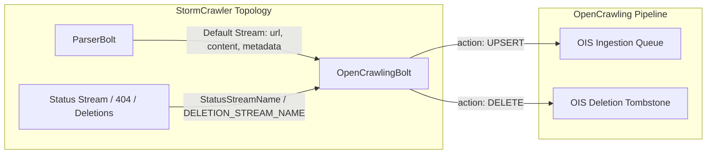

# OpenCrawling - Apache StormCrawler Bolt

The `oc-stormcrawler-bolt` module provides an Apache Storm Bolt library (`org.opencrawling:oc-stormcrawler-bolt`) that intercepts parsed web documents and URL lifecycle status streams from **Apache StormCrawler** topologies.

It normalizes crawled records into **Open Ingestion Standard (OIS)** payloads:
- **`action: "UPSERT"`**: For newly discovered and updated web pages emitted by `ParserBolt`.
- **`action: "DELETE"`**: For removed pages, deleted URLs, and HTTP 404/410 status events emitted via the StormCrawler status stream (`StatusStreamName` / `DELETION_STREAM_NAME`).

## Architecture & Stream Mapping



## Features
- **Dual-Stream Processing**: Seamlessly ingests parsed content tuples and handles status deletion signals.
- **OIS Compliance**: Maps crawled web pages into standard OIS `UPSERT` documents and deletion `tombstones`.
- **Content Deduplication**: Calculates document content hashes (`SHA-256` or `MD5`) for deduplication and incremental crawl detection.
- **Flexible Dispatching**:
  - `REST`: Dispatches OIS JSON payloads via HTTP POST to the OpenCrawling ingestion runtime (`/api/v1/ingest/ois`).
  - `MEMORY`: In-memory dispatcher for embedded topologies and test suites.

## Topology Configuration (`crawler-conf.yaml`)

```yaml
config:
  topology.workers: 2
  topology.message.timeout.secs: 30
  
  # OpenCrawling Bolt Configuration
  opencrawling.target.endpoint: "http://localhost:8080/api/v1/ingest/ois"
  opencrawling.transport.mode: "REST" # Options: REST, MEMORY
  opencrawling.emit.deletions: true
  opencrawling.status.stream.id: "status"
  opencrawling.hash.algorithm: "SHA-256"
  opencrawling.instance.id: "stormcrawler-cluster-01"
```
